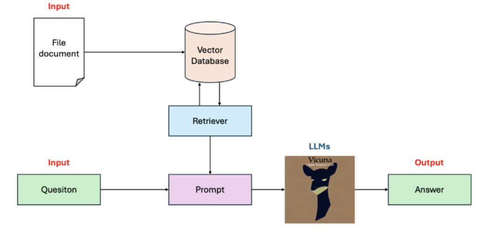
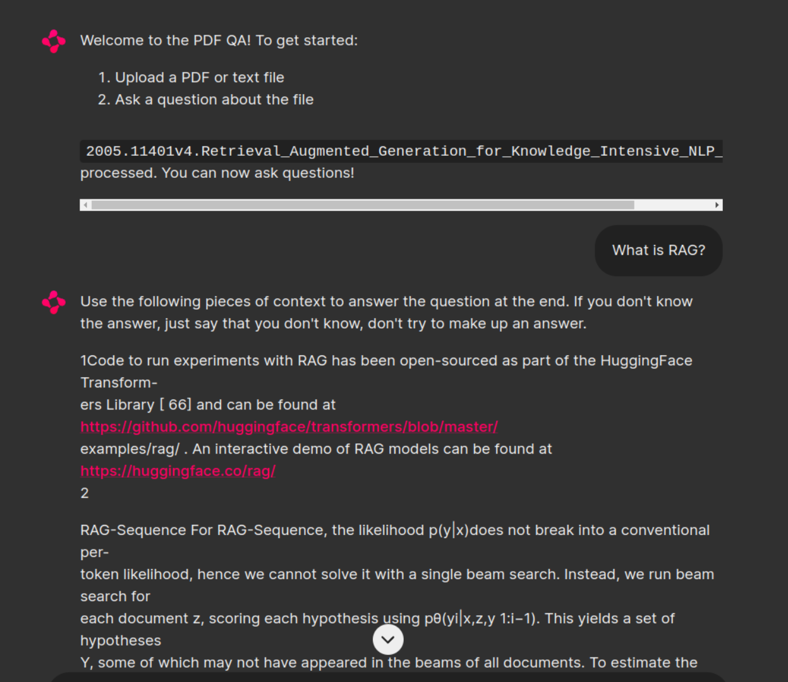

# RAG-Application-Lesson-Docs-QA

## Description

In this project, we explore the use of **Retrieval Augmented Generation (RAG)** to improve the quality of responses generated by Large Language Models (LLMs). RAG enhances LLMs by incorporating retrieved information from a document database, making the generated content more accurate and relevant.

- **Input**: A document file and a related question.
- **Output**: An answer derived from the document content.

## Pipeline

<div align="center">
  
</div>

## Demo

<div align="center">
  
</div>

## How to use

### I. Run without UI 

You will run the project in the file **RAG_Without_UI.ipynb** to test an example.

### 2. Run with UI using chainlit

You will run the file **RAG_With_UI.ipynb** and follow the step-by-step instructions in the file, but there will be some notes when deploying with ngrok. Alternatively, you can use Colab to clone this project and run it for simplicity.

Next, I will provide step-by-step instructions to run the project on google colab.

#### 2.1 Clone this repository

```bash
!git clone https://github.com/zoanhy20/RAG-Application-Lesson-Docs-QA.git
!cd RAG-Application-Lesson-Docs-QA
```

#### 2.2 Install all reuired packages

```bash
!pip install -q transformers==4.41.2
!pip install -q bitsandbytes==0.43.1
!pip install -q accelerate==0.31.0
!pip install -q langchain==0.2.5
!pip install -q langchainhub==0.1.20
!pip install -q langchain-chroma==0.1.1
!pip install -q langchain-community==0.2.5
!pip install -q langchain-openai==0.1.9
!pip install -q langchain_huggingface==0.0.3
!pip install -q chainlit==1.1.304
!pip install -q python-dotenv==1.0.1
!pip install -q pypdf==4.2.0
!npm install -g localtunnel
!pip install -q numpy==1.24.4
```

#### 2.3  Install and config ngrok

```bash
!pip install -q ngrok
```

Add your token in ngrok

```bash
from ngrok import ngrok
!ngrok config add-authtoken <YOUR_TOKEN_IN_NGROK>
```

Show the public network for connecting after building the project.

```bash
public_url = ngrok.connect(8000).public_url
print(f"Public URL: {public_url}")
```

#### 2.4 Build project with chainlit

```bash
!chainlit run app.py
```
